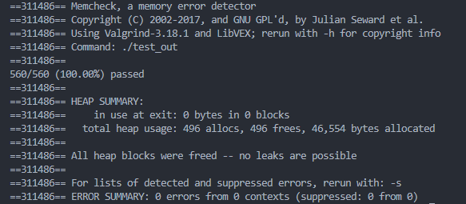

# Doc of My Json library (leptjson)

## 项目结构

参照 Milo Yip 原教程的设计，此处 JSON 库名为 my leptjson，其中包含三个代码文件和一个 Makefile 文件：

1. `leptjson.h`：leptjson 的头文件（header file），含有对外的类型和 API 函数声明。
2. `leptjson.c`：leptjson 的实现文件（implementation file），含有内部的类型声明和函数实现。此文件会编译成库。
3. `test.c`：我们使用测试驱动开发（test driven development, TDD）。此文件包含测试程序，需要链接 leptjson 库。
4. `Makefile`：执行测试用例所用 Makefile 文件

## Json 语法

### 简介

仅支持标准  `Json` 语法 [RFC7159](https://tools.ietf.org/html/rfc7159)

仅支持 `utf-8` 编码 [UNICODE](http://www.unicode.org/versions/latest/)

### [ABNF](https://tools.ietf.org/html/rfc5234) 描述

```
/* value */
value = false / null / true / object / array / number / string
```

```
/* whitespace */
ws = *(
	%x20 /              ; Space
	%x09 /              ; Horizontal tab
	%x0A /              ; Line feed or New line
	%x0D )              ; Carriage return
```

```
/* false */
false = %x66.61.6c.73.65    ; false
```

```
/* null */
null  = %x6e.75.6c.6c       ; null
```

```
/* true */
true  = %x74.72.75.65       ; true
```

```
/* number */
number = [ minus ] int [ frac ] [ exp ]
	decimal-point = %x2E       		; .
	digit1-9 = %x31-39         		; 1-9
	e = %x65 / %x45            		; e E
	exp = e [ minus / plus ] 1*DIGIT
	frac = decimal-point 1*DIGIT
	int = zero / ( digit1-9 *DIGIT )
	minus = %x2D               		; -
	plus = %x2B                		; +
	zero = %x30                		; 0
```

```
/* string */
string = quotation-mark *char quotation-mark

	char = unescaped /
	   escape (
              %x22 /          		; "    quotation mark  U+0022
              %x5C /          		; \    reverse solidus U+005C
              %x2F /          		; /    solidus         U+002F
              %x62 /          		; b    backspace       U+0008
              %x66 /          		; f    form feed       U+000C
              %x6E /          		; n    line feed       U+000A
              %x72 /          		; r    carriage return U+000D
              %x74 /          		; t    tab             U+0009
              %x75 4HEXDIG )  		; uXXXX                U+XXXX

	   escape = %x5C              	; \
	   quotation-mark = %x22      	; "
	   unescaped = %x20-21 / %x23-5B / %x5D-10FFFF
```

```
/* array */
array = begin-array [ value *( value-separator value ) ] end-array

	begin-array     = ws %x5B ws  	; [ left square bracket
	value-separator = ws %x2C ws  	; , comma
	end-array       = ws %x5D ws  	; ] right square bracket
```

```
/* object */
object = begin-object [ member *( value-separator member ) ] end-object
	begin-object    = ws %x7B ws  ; { left curly bracket
	member = string name-separator value
	value-separator = ws %x2C ws  	; , comma
	end-object      = ws %x7D ws  ; } right curly bracket
```

## 接口设计

### 设计简介

接口设计方面基本参照了 `Milo Yip` 原教程中的接口定义，也进行了一定修改。

1. `Milo Yip` 原教程中常采用函数返回指针后再使用其他函数对返回的指针进行操作的写法，我在此处尽可能的将其重构为输入待操作指针，对指针所指对象进行操作，而将函数返回值则修改为 `void `类型。（因为我不常写纯 `c` 语言代码，我无法理解 `Milo Yip` 此种写法的精髓之处。以我粗浅的理解这种将指针传出的设计将会给外部函数提供随意修改该地址内容的机会，这将会带来较大的不确定性，似乎并不优雅。）
2. 出于安全性考虑，此项目中采用 `const` 语法对 `get` 类型的获取对象函数返回值以及各函数中不需要修改的输入值进行修饰，以确保不产生意外的数据修改问题。
3. 出于调用一致性考虑，对 Json 对象的部分操作接口函数进行了封装和重构。

### 基本操作思路


## 接口描述

此处将对该 Json 库的主要操作接口进行描述

### Json 树形结构定义

```c
/* Json value */
struct lept_value {
	union {
		struct {
			lept_member* m;
			size_t size, capacity;
		} o; /* object */
		struct {
			lept_value* e;
			size_t size, capacity;
		} a; /* array */
		struct {
			char* s;
			size_t len;
		} s; /* string */

		double n; /* number */
	} u;

	lept_type type; /* Json value type */
};
```

```c
/* Json member */
struct lept_member {
	char k;
	size_t klen;  /* key string */
	lept_value v; /* value */
};
```

### Json 基本操作

```c
/* Json parse */
int lept_parse(lept_value* v, const char* json);

/* Json stringify */
char* lept_stringify(const lept_value* v, size_t* length);

/* copy move swap */
void lept_copy(lept_value* dst, const lept_value* src);
void lept_move(lept_value* dst, lept_value* src);
void lept_swap(lept_value* lhs, lept_value* rhs);

/* Json free */
void lept_free(lept_value* v);

/* Json type get */
lept_type lept_get_type(const lept_value* v);

/* Json equal */
int lept_is_equal(const lept_value* lhs, const lept_value* rhs);
```

### Json 值操作

#### null

```c
#define lept_set_null(v) lept_free(v)
```

#### false & true

```c
/* init and modify */
void lept_set_boolean(lept_value* v, int b);

/* boolean get */
int lept_get_boolean(const lept_value* v);
```

#### number

```c
/* init and modify */
void lept_set_number(lept_value* v, double n);

/* number get */
double lept_get_number(const lept_value* v);
```

#### string

```c
/* init and modify */
void lept_set_string(lept_value* v, const char* s, size_t len);

/* string get */
const char* lept_get_string(const lept_value* v);
size_t lept_get_string_length(const lept_value* v);
```

#### array

```c
/* init */
void lept_set_array(lept_value* v, size_t capacity);

/* capacity and size get */
size_t lept_get_array_size(const lept_value* v);
size_t lept_get_array_capacity(const lept_value* v);

/* dynamic array capacity operator */
void lept_reserve_array(lept_value* v, size_t capacity);
void lept_shrink_array(lept_value* v);
void lept_clear_array(lept_value* v);

/* array operator */
const lept_value* lept_get_array_element(const lept_value* v, size_t index);
void lept_pushback_array_element(lept_value* v, const lept_value* e);
void lept_popback_array_element(lept_value* v);
void lept_insert_array_element(lept_value* v, const lept_value* e, size_t index);
void lept_erase_array_element(lept_value* v, size_t index, size_t count);
```

#### object

```c
/* init */
void lept_set_object(lept_value* v, size_t capacity);

/* capacity and size get */
size_t lept_get_object_size(const lept_value* v);
size_t lept_get_object_capacity(const lept_value* v);

/* dynamic array capacity operator */
void lept_reserve_object(lept_value* v, size_t capacity);
void lept_shrink_object(lept_value* v);
void lept_clear_object(lept_value* v);

/* object key get */
const char* lept_get_object_key(const lept_value* v, size_t index);
size_t lept_get_object_key_length(const lept_value* v, size_t index);

/* object element operate */

/* element get by index,key */
const lept_value* lept_get_object_value_by_index(const lept_value* v, size_t index);
const lept_value* lept_get_object_value_by_key(const lept_value* v, const char* key, size_t klen);

/* element remove by index,key */
int lept_remove_object_value_by_index(lept_value* v, size_t index);
int lept_remove_object_value_by_key(lept_value* v, const char* key, size_t klen);

/* element set by index,key */
/* insert when the index,key not exist */
int lept_set_object_value_by_index(lept_value* v, size_t index, const lept_value* s_v);
int lept_set_object_value_by_key(lept_value* v, const char* key, size_t klen, const lept_value* s_v);

/* object element find */
size_t lept_find_object_index(const lept_value* v, const char* key, size_t klen);
const lept_value* lept_find_object_value(const lept_value* v, const char* key, size_t klen);
```

## 测试

### 测试用例

教程中设计测试用例全部通过，未对测试用例进行进一步扩展

`560/560 (100.00%) passed`

在后续 `mJson` 项目中将会考虑进一步使用 `gcov` 等工具进行覆盖率测试

### Valgrind 测试

`valgrind` 测试中主要存在以下问题，最终全部解决。

#### `1. Conditional jump or move depends on uninitialised value(s)`

该问题出现在以下位置

```c
/void lept_free(lept_value* v){

	/* ...... */

	assert(v != NULL);
	switch (v->type) {

		/* ...... */

	}

	/* ...... */
}
```

但我并未理解 `valgrind` 所提出的该处未初始化跳转问题的含义。

在我理解下，由于使用断言 `assert(v! = NULL)` 对输入值进行约束，对于输入值其必定会被初始化。

因而并未对于该问题进行修正。

> 4.16 解决：确实是因为未初始化而产生的问题

在下列两个位置，由于需要插入元素位置此前未进行初始化，故当插入时调用 `lept_copy()`，进而调用 `lept_free()` 从而导致使用未初始化的 `v->type` 进行 `switch(v->type)` 语句判断，产生上述问题。由于此时未初始化默认值为 `0` 与 `LEPT_NULL` 值相同，故仍表现为正常执行。

```c
int lept_set_object_value_by_key(lept_value* v, ...) {

	/* ...... */

	lept_value_init(&(ptr->v));			/* add */
	lept_copy(&(ptr->v), s_v);
	v->u.a.size++;

	/* ...... */

}
```

```c
void lept_pushback_array_element(lept_value* v, ...){

	/* ...... */

	lept_value_init((v->u.a.e) + v->u.a.size); 	/* add */
	lept_copy((v->u.a.e) + v->u.a.size, e);
	v->u.a.size++;

	/* ...... */

}
```

此外是在以下两个位置。由于此前此处循环释放 `capacity` 次，因而导致 `size <= index < capacity` 位置未初始化元素被 `lept_free()` 递归释放，从而导致使用未初始化的 `v->type` 进行 `switch(v->type)` 语句判断，产生上述问题。由于此时未初始化默认值为 `0` 与 `LEPT_NULL` 值相同，故仍表现为正常执行。

```c
void lept_free(lept_value* v){

	/* ...... */

	for (i = 0; i < v->u.a.size; i++)		/* capacity -> size */
		lept_free(&v->u.a.e[i]);

	/* ...... */

}

```c
void lept_free(lept_value* v){

	/* ...... */

	for (i = 0; i < v->u.o.size; i++) {		/* capacity -> size */
		free_ptr(v->u.o.m[i].k);
		lept_free(&v->u.o.m[i].v);
	}

	/* ...... */

}
```

出于对初始化情况的考虑，在此对类型联合进行修改。
此外在 `lept_free()` 函数中增加判断 Json value 是否初始化的断言。

```c
typedef enum {
	LEPT_NULL = 1,	/* 0 -> 1 */
	LEPT_FALSE,
	LEPT_TRUE,
	LEPT_NUMBER,
	LEPT_STRING,
	LEPT_ARRAY,
	LEPT_OBJECT,
} lept_type;

```

```c
void lept_free(lept_value* v){
	assert(v != NULL && v->type >= LEPT_NULL); 	/* add  v->type >= LEPT_NULL */

	/* ...... */

}
```

#### `2. Invalid read `

该问题出现在以下代码位置

```c
int lept_remove_object_value_by_index(lept_value* v, size_t index){

	/* ...... */

	size_t i;
	for (i = index; i < v->u.o.size; i++) {		/* move the v->u.o.size-- before for() ) */
		memcpy(v->u.o.m + i, v->u.o.m + i + 1, sizeof(lept_member));
	}

	/* ...... */

}
```

由于疏忽在遍历前未对 `v->u.o.size` 数值进行自减操作，从而导致在 `memcpy` 过程中发生了越界访问

同时这也可能是之前在 下述代码第 `12` 行位置 `j = 5、i = 5 `时发生 `segment fault: realloc(): invalid next size` 的原因

```c
static void test_access_object(){

	/* ...... */

	for (j = 0; j <= 5; j += 5) {

		lept_set_object(&o, j);
		EXPECT_EQ_SIZE_T(0, lept_get_object_size(&o));
		EXPECT_EQ_SIZE_T(j, lept_get_object_capacity(&o));

		for (i = 0; i < 10; i++) {
			char key[2] = "a";
			key[0] += i;
			lept_value_init(&v);
			lept_set_number(&v, i);
			lept_set_object_value_by_key(&o, key, 1, &v);

			lept_free(&v);
		}

		/* ...... */

	}

	/* ...... */

}
```

#### `3. memory free `

泄漏主要发生在以下位置

```c
void lept_copy(lept_value* dst, const lept_value* src) {

	/* ...... */

	for (i = 0; i < src->u.o.size; i++) {
		lept_value* val = (lept_value*)malloc(sizeof(lept_value));
		lept_value_init(val);

		/* key-value */
		lept_copy(val, &src->u.o.m[i].v);
		lept_set_object_value_by_key(dst, src->u.o.m[i].k,
				                             src->u.o.m[i].klen, val);

		/* lept_free 只进行了内部空间的释放 */
		lept_free(val);				/* add */
		free(val);				/* add */
	}

	/* ...... */

}
```

此调用中最初疏忽未对 `val` 变量进行释放

此外是在字符串方面的问题

```c
void lept_set_string(lept_value* v, const char* s, size_t len){

	/* ...... */

	v->u.s.s = (char*)malloc(len + 1);
	memcpy(v->u.s.s, s, len);

	/* ...... */

}
```

```c
int lept_set_object_value_by_key(lept_value* v, const char* key ...){

	/* ...... */

	free(ptr->k);
	ptr->k = (char*)malloc(klen + 1);

	/* ...... */

}
```

因为对内存分配不够熟悉熟悉，特别是在 `c` 风格字符串空间的处理方面仍存在一些困惑未能理解，因而未能解决

该内存泄漏问题及解决方案就留待以后再进行修订吧

此时程序堆空间使用与释放情况

`in use at exit: 38 bytes in 13 blocks`

`total heap usage: 496 allocs, 483 frees, 46,554 bytes allocated`

> 4.16 解决：并不是指示位置的问题

起初使用 `Valgrind` 测试时其指示位置为上述两处字符串位置。正巧刷到了几篇关于 c 字符串尾部 `\0` 的不当操作导致的内存浪费的博客，因而就下意识认为这里也可能是这个因素导致。然而实际上 `Valgrind` 指出的不过是发生泄漏内存分配时的位置，而应该执行内存释放的其实是其他地方。
当今晚我尝试修复内存泄漏问题时，我突然意识到上文中 `lept_set_object_value_by_key()` 函数中语句 `free(ptr->k)` 并没有存在的必要，因为在此时执行插入时 `ptr->k`指针必然未被初始化。为了验证这一想法，我选择去检查 `lept_remove_object_value_by_index()`是否会完成空间的释放。于是就发现了这里的问题。在该函数中因为疏忽我仅仅将后续位置对象地址逐个前移，而并没有释放被删除对象堆上分配的空间。

```c
int lept_remove_object_value_by_index(lept_value* v, size_t index) {

	/* ...... */

	lept_member* ptr = v->u.o.m + index;	/* add */
	free_ptr(ptr->k);			/* add */
	lept_free(&(ptr->v));			/* add */

	size_t i;
	for (i = index; i < v->u.o.size; i++) {
		memcpy(v->u.o.m + i, v->u.o.m + i + 1, sizeof(lept_member));
	}

	/* ...... */

}
```

此后对 `lept_erase_array_element()` 进行检查，解决最后的内存泄漏问题。

```c
void lept_erase_array_element(lept_value* v, size_t index, size_t count) {

	/* ...... */

	for (i = index; i < index + count; i++)			/* add */
		lept_free(v->u.a.e + i);			/* add */

	/* memcpy */
	for (i = index + count; i < v->u.a.size; i++)
		memcpy((v->u.a.e) + i - count, (v->u.a.e) + i, sizeof(lept_value));

	/* ...... */

}
```

#### 最终程序 Valgrind 测试报告



## 使用示例

```c
/* ......  */

/* 可参考各接口函数测试用例使用，此处不再重复介绍 */

/* ......  */
```
